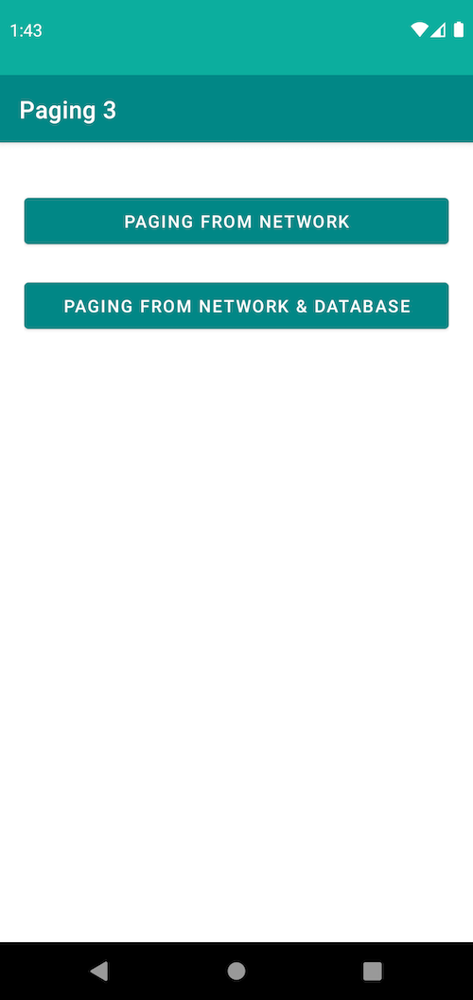

# Android Paging Library

A sample project to demonstrate usage of [Paging 3 Library](https://developer.android.com/topic/libraries/architecture/paging/v3-overview).

# App's Functionality
1. Implementation of the Paging 3  library components.
2. Add a loading status header and footer to your list.
3. Show loading progress between every new repository search.
4. Add separators in your list.
5. Add database support for paging from network and database

# Paging library 3 Overview

## Benefits

The Paging library includes the following features:

a) In-memory caching for your paged data. This ensures that your app uses system resources efficiently while working with paged data.

b) Built-in request deduplication, ensuring that your app uses network bandwidth and system resources efficiently.

c) Configurable RecyclerView adapters that automatically request data as the user scrolls toward the end of the loaded data.

d) First-class support for Kotlin coroutines and Flow, as well as LiveData and RxJava.

e) Built-in support for error handling, including refresh and retry capabilities.

## Paging Library Components
`PagingData` - a container for paginated data. Each refresh of data will have a separate corresponding `PagingData`.

`PagingSource` - a `PagingSource` is the base class for loading snapshots of data into a stream of `PagingData`.

`Pager.flow` - builds a `Flow<PagingData>`, based on a `PagingConfig` and a function that defines how to construct the implemented `PagingSource`.

`PagingDataAdapter` - a `RecyclerView.Adapter` that presents `PagingData` in a `RecyclerView`. The `PagingDataAdapter` can be connected to a Kotlin `Flow`, a `LiveData`, an `RxJava Flowable`, or an `RxJava Observable`. The `PagingDataAdapter` listens to internal PagingData loading events as pages are loaded and uses `DiffUtil` on a background thread to compute fine-grained updates as updated content is received in the form of new `PagingData` objects.

`RemoteMediator` - helps implement pagination from network and database.

# Screenshots

Options                    |  Search                     |
:------------------------:|:------------------------:|
    |  

## Paging from network

Load data from network requests on each page by tracking user's scroll event.

## Paging from network and database

Demonstration of offline support to our app by saving the data in a local database. That way, the database will be the source of truth for our app and we will always load data from there. Whenever we don't have any more data, we request more from the network and then save it in the database. Because the database is the source of truth, the UI will be automatically updated when more data is saved.